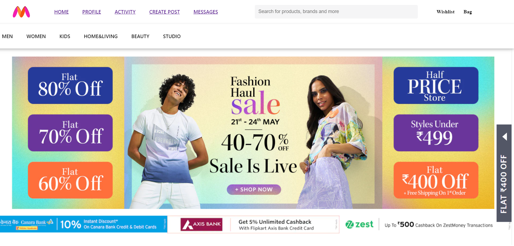
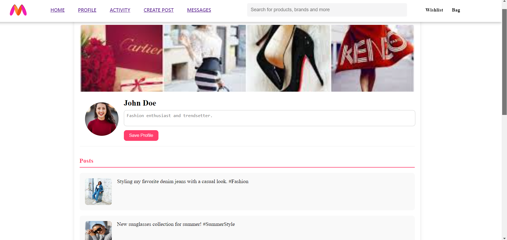
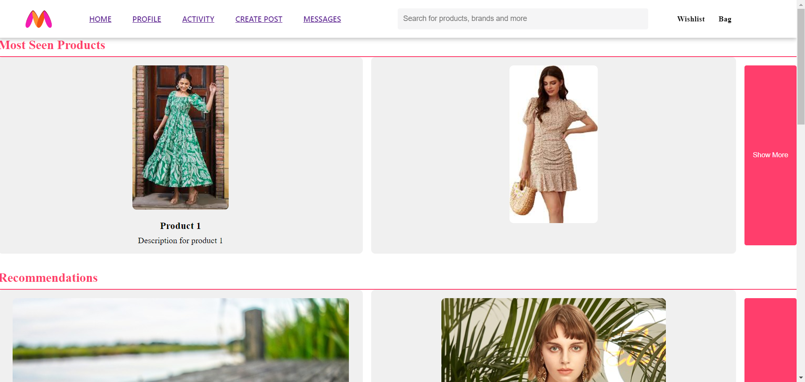

# Myntra Prototype

[](https://riyajadhao.github.io/Myntra-Hacker-ramp-We-for-she)
[](https://github.com/riyajadhao/Myntra-Hacker-ramp-We-for-she/blob/main/LICENSE)
[](https://github.com/riyajadhao/Myntra-Hacker-ramp-We-for-she/stargazers)

## Overview
This is a prototype of the Myntra app developed for the Myntra Hacker Ramp event. It aims to resemble the Myntra website and includes additional features to enhance user engagement, particularly targeting Gen Z fashion culture.

## Features
- **First Login Screen**: User authentication and onboarding.
- **Home Screen**: Fashion content feed, recommendations, and promotions.
- **Profile Screen**: User profile details, including pictures, posts, and activities.
- **Activity Screen**: Displays user's most seen products, recommendations, posts from friends, and user activities.
- **Post Creation**: Users can create posts about their purchases and fashion recommendations.
- **Messaging**: Chat feature to connect with friends, share and recommend products.
- **Product Details**: Detailed view of fashion products with options to purchase, share, and recommend.

## Additional Features
- **Social Friend Feature**: Add and follow friends, see their posts and recommendations.
- **One-Click Share**: Easily share products and posts with friends.
- **Creative Design**: Colorful, trendy, and engaging UI/UX, particularly appealing to Gen Z.

## Technology Stack
- **Frontend**: HTML, CSS, JavaScript

## Installation
To set up the project locally, follow these steps:

1. Clone the repository:
    ```sh
    git clone https://github.com/riyajadhao/Myntra-Hacker-ramp-We-for-she.git
    ```
2. Navigate to the project directory:
    ```sh
    cd Myntra-Hacker-ramp-We-for-she
    ```
3. Open `index.html` in your browser to view the app.

## Usage
- Open `index.html` in your browser to view the app.
- Explore the home screen, profile screen, activity screen, and more.
- Connect with friends, share products, and enjoy the interactive UI.

## Live Demo
Check out the live demo of the project [here](https://riyajadhao.github.io/Myntra-Hacker-ramp-We-for-she).

## Screenshots

*Caption: Home Screen with fashion content and recommendations.*


 (screenshots\profile-screen1.png)
*Caption: User profile with posts and activities.*


 (screenshots\activity-screen1.png)
 (screenshots\activity-screen2.png)
 (screenshots\activity-screen3.png)
*Caption: User's activity screen showing recommendations and friend posts.*


 (screenshots\create-post screen2.png)
 *Caption: User's Create Posts screen showing  purchases and fashion recommendations.*


*Caption: User's Message screen showing  Chat feature to connect with friends, share and recommend products.*
## Contributing
Contributions are welcome! Follow these steps to contribute:

1. Fork the repository.
2. Create a new branch (`git checkout -b feature-branch`).
3. Commit your changes (`git commit -m 'Add some feature'`).
4. Push to the branch (`git push origin feature-branch`).
5. Open a pull request.

## License
This project is licensed under the MIT License. See the [LICENSE](LICENSE) file for more details.

## Contact
For any questions or feedback, please reach out to [riyajadhao35@gmail.com].

## Links
- [Live Demo](https://riyajadhao.github.io/Myntra-Hacker-ramp-We-for-she)
- [Project Documentation](#)
- [GitHub Repository](https://github.com/riyajadhao/Myntra-Hacker-ramp-We-for-she)
